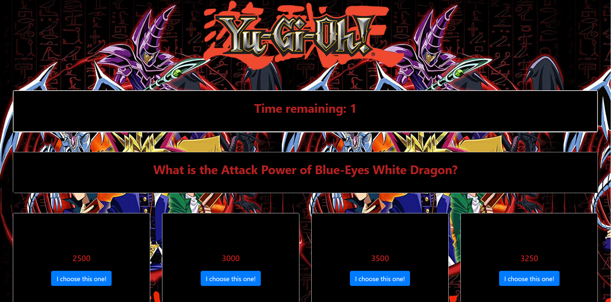

# TriviaGame

[Link to the site!](https://darryljltolentino.github.io/TriviaGame/)

## Description
This is a website that features a trivia game that is Yu-Gi-Oh themed. The user needs to answer ten questions and will see how well they did after the quiz. There is a start button that plays music and the quiz on click. The user has 10 seconds to answer each question. If the user answers the question right, the results screen at the bottom would should that the user is correct. If the user answers incorrectly, the results screen would show that the user is incorrect and would show the correct answer. If the timer times out, the results screen would show that the timer ran out and would display the correct answer. Once the user finishes the quiz, the results screen will display how many correct answers, incorrect answers, and timed out answers the user has. A reset button will appear that the user can click on to reset the whole quiz so the user can try again. All the logic was coded using jQuery and JavaScript, while styling and layout of the game was coded in HTML, Bootstrap, and CSS.

| Technology Used | Reference |
| --------------- | --------- |
| HTML | https://developer.mozilla.org/en-US/docs/Web/HTML |
| CSS | https://developer.mozilla.org/en-US/docs/Web/CSS |
| Bootstrap | https://getbootstrap.com/ |
| JavaScript | https://www.javascript.com/ |
| jQuery | https://jquery.com/ |

######
| Versioning | Reference |
| ---------- | --------- |
| Github | https://github.com/ |

## Author
- Darryl Tolentino

## Acknowledgement
- Jake Dudum: For bouncing ideas while coding the game